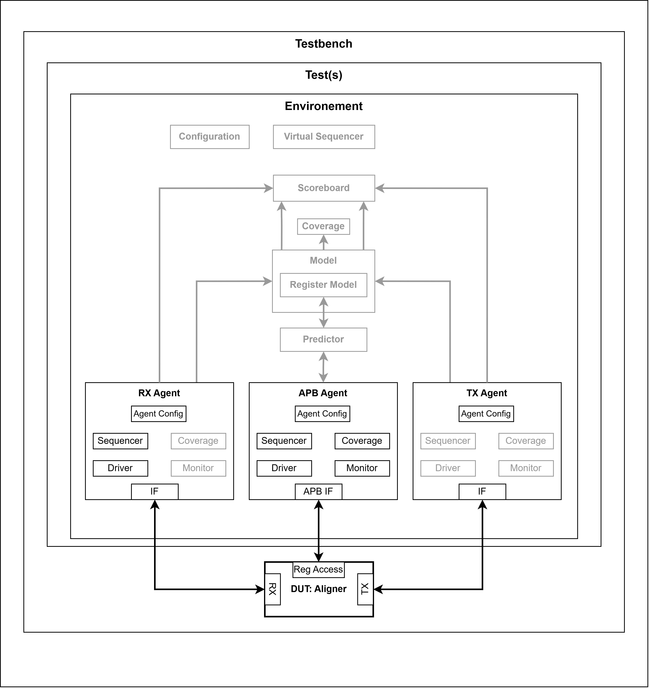

`Under construction...`


## Overview: 
This project is practice of [Udemy Course](https://www.udemy.com/course/design-verification-with-systemverilog-uvm/), that has the goal to build a verification environement based on the UVM (Universal Verification Methodology) labrary for a an RTL design that aligns data packets which has internal register that can be configured using an APB interface. 

The current state of the built environement is represented in the figure bellow, the blocks that are developed are the ones that are clear to see in the schematic. 

However, the final version of the verification environement is in the image `doc/Env-Verif-Arch-goal.jpg`



### Notes:
- 
- The developed APB agent is not supporting the verification of the full version of the APB protocol.

### Disclaimer:
> The RTL design was not devloped by me. All intellectual property rights and copyrights remain with the original author (The Udemy Course Owner).


## Mini User Guide:

### Pre-requirements:
- Linux Based Operating System;
- Installed QuestaSim, or its free version ModelSim; and
- In case of using UVM libraries: the uvm-1.2 library should be downloaded online and located under `$(HOME)/uvm-1.2`.

### How to use:
Currently the only simulator that is supported is Modelsim (aka QuestaSim). 
The makefile targets are used as the following:
```
make <target>  
```
#### Targets: 
```
    all      : Clean, Compile and Simulate the project.
    compile  : compile the project.
    simulate : simulate the project using ModelSim.
               GUI=<1|0> 1: with GUI, 0: without GUI.
    clean    : clean work directory.
```


## Project Structure: 
    .
    ├── Makefile
    ├── README.md
    ├── doc
    │   ├── figures.drawio
    │   ├── Env-Verif-Arch-Achievement.jpg
    │   └── Env-Verif-Arch-goal.jpg
    ├── rtl
    │   ├── cfs_aligner_core.v
    │   ├── cfs_aligner.v
    │   ├── cfs_ctrl.v
    │   ├── cfs_edge_detect.v
    │   ├── cfs_regs.v
    │   ├── cfs_rx_ctrl.v
    │   ├── cfs_synch_fifo.v
    │   ├── cfs_synch.v
    │   ├── cfs_tx_ctrl.v
    │   └── design.sv
    ├── tb
    │   ├── algn_env.sv
    │   ├── algn_pkg.sv
    │   ├── algn_test_base.sv
    │   ├── algn_test_defines.sv
    │   ├── algn_test_pkg.sv
    │   ├── algn_test_random.sv
    │   ├── algn_test_reg_access.sv
    │   ├── apb_agent_config.sv
    │   ├── apb_agent.sv
    │   ├── apb_coverage.sv
    │   ├── apb_driver.sv
    │   ├── apb_if.sv
    │   ├── apb_item_base.sv
    │   ├── apb_item_drive.sv
    │   ├── apb_item_monitor.sv
    │   ├── apb_monitor.sv
    │   ├── apb_pkg.sv
    │   ├── apb_reset_handler.sv
    │   ├── apb_sequence_base.sv
    │   ├── apb_sequence_random.sv
    │   ├── apb_sequencer.sv
    │   ├── apb_sequence_rw.sv
    │   ├── apb_sequence_simple.sv
    │   ├── apb_types.sv
    │   ├── md_agent_config_master.sv
    │   ├── md_agent_config_slave.sv
    │   ├── md_agent_config.sv
    │   ├── md_agent_master.sv
    │   ├── md_agent_slave.sv
    │   ├── md_agent.sv
    │   ├── md_driver_master.sv
    │   ├── md_driver_slave.sv
    │   ├── md_driver.sv
    │   ├── md_if.sv
    │   ├── md_item_base.sv
    │   ├── md_item_drv_master.sv
    │   ├── md_item_drv.sv
    │   ├── md_pkg.sv
    │   ├── md_reset_handler.sv
    │   ├── md_sequence_base.sv
    │   ├── md_sequencer_master.sv
    │   ├── md_sequencer.sv
    │   ├── md_sequence_simple_master.sv
    │   └── testbench.sv
    └── work
        └──...


## Contacts:
- abderrahimelhamzi.dev@gmail.com